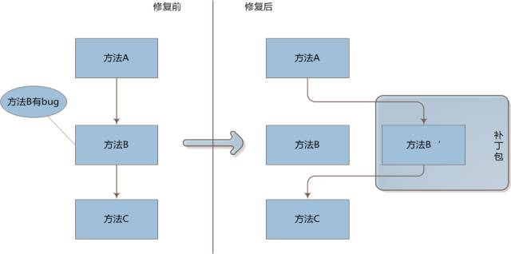
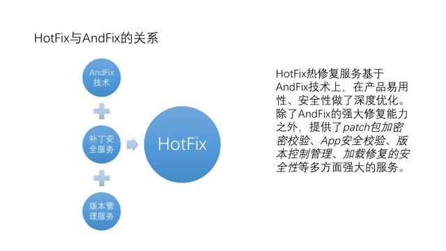
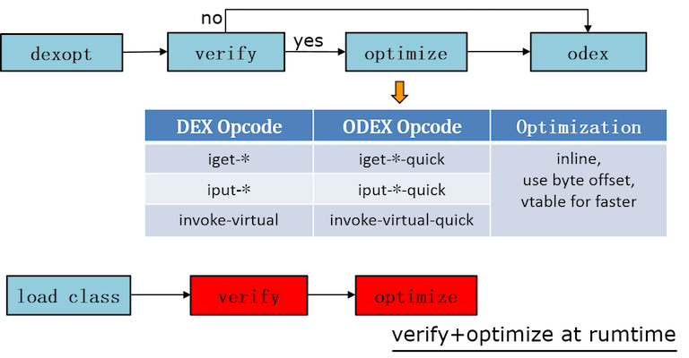
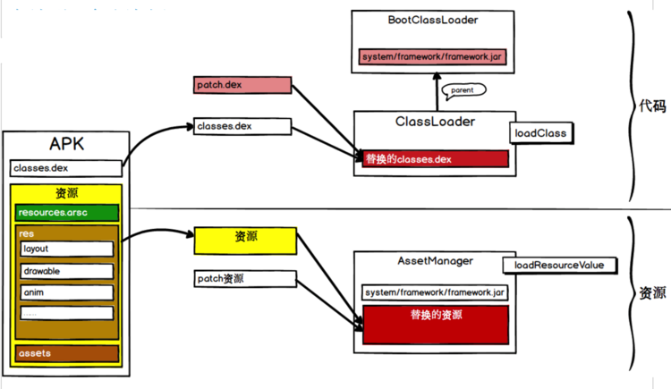
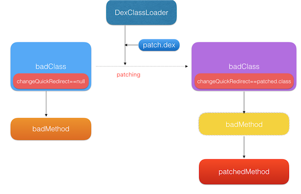

# 热修复
author: 周露

## 目录
- 什么是热修复
- 三大方案
- Native原理
- ClassLoader原理
- InstantRun的热部署原理
- 总结

## 什么是热修复
无需重新安装，用户无感知的在线修复bug的一种技术

## 三大方案
我们从实现方式将其分为
- Native方案
- ClassLoader方案
- InstantRun的热部署方案

### Native方案

- Andfix(https://github.com/alibaba/AndFix)
- Hotfix1.x

### ClassLoader方案

- Qzone(https://zhuanlan.zhihu.com/p/20308548)
- Nuwa(https://github.com/jasonross/Nuwa)
- Recoofix(https://github.com/dodola/RocooFix)
- Tinker(https://github.com/Tencent/tinker)
- Aceso(https://github.com/meili/Aceso)

### InstantRun的热部署方案

- Robust(https://github.com/Meituan-Dianping/Robust)
- Amigo(https://github.com/eleme/Amigo)

## Native实现原理



### Andfix


- 优点：即时生效，性能损耗较小；足够轻量
- 缺点：兼容性不佳；Native Crash 难调试；能力有限

### Hotfix 1.x



## ClassLoader实现原理


### 65536及LinearAlloc限制
```java
- UNEXPECTED TOP-LEVEL EXCEPTION: JAVA.LANG.ILLEGALARGUMENTEXCEPTION: METHOD ID NOT IN [0, 0XFFFF]: 65536
```
- 65536限制的主要原因是DVM Bytecode的限制，DVM指令集的方法调用指令invoke-kind索引为16bits，最多能引用65535个方法。

```java
- Dexopt fails with "LinearAlloc exceeded" for deep interface hierarchies
```

- dexopt使用LinearAlloc来存储应用的方法信息，当方法数量过多导致超出缓冲区大小时，会造成dexopt崩溃。

### 

```java
//DexPathList.java
    public Class findClass(String name) {
        for (Element element : dexElements) {
            DexFile dex = element.dexFile;
            if (dex != null) {
                Class clazz = dex.loadClassBinaryName(name, definingContext);
                if (clazz != null) {
                    return clazz;
                }
            }
        }
        return null;
    }
```

### PREVERIFY



Class ref in pre-verified class resolved to unexpected implementation

###  

Dalvik: classes(..N).dex -> classes(..N).odex
- Dalvik 虚拟机在安装期间，为Class 打上 CLASS_ISPREVERIFIED 是为了提高性能，下次使用时，则会省去校验操作，提高访问效率。
- 被标上“CLASS_ISPREVERIFIED”的类，dvm在运行期载入Class时候，会对其内存中对应的直接引用类进行校验，如果该类存在与直接引用类所在的dex不是同一个，则直接报“pre-verification” 错误，该类无法加载。

ART: classes(..N).dex -> 一个oat
- AOT Ahead-Of-Time 预编译,在应用程序安装的过程中，ART就已经将所有的字节码重新编译成了机器码。应用程序运行过程中无需进行实时的编译工作，只需要进行直接调用。

###  

```java
ClassObject* dvmResolveClass(const ClassObject* referrer, u4 classIdx,
    bool fromUnverifiedConstant){
....
   if (!fromUnverifiedConstant &&
        IS_CLASS_FLAG_SET(referrer, CLASS_ISPREVERIFIED)) {
            ...
            if (referrer->pDvmDex != resClassCheck->pDvmDex &&
               resClassCheck->classLoader != NULL) {
                 ALOGW("Class resolved by unexpected DEX:"..);
               }
        }
...
}
```

###  

当三个条件均满足时，会抛出异常，解决方案大致上有以下四种。
1. 修改fromUnverfiedConstant=true
需要通过 native hook 拦截系统方法，更改方法的入口参数，将 fromUnverifiedConstant 统一改为 true，风险大，几乎无人采用。
2. 禁止dexopt过程打上CLASS_ISPREVERIFIED标记
Q-zone方案突破了此限制，但是损失了性能。
3. 补丁类与引用类放在同一个dex中
Tinker等全量合成方案突破了此限制。
4. 使dvmDexGetResolvedClass返回不为null，直接返回
QFix的方案

### Qzone/Nuwa

```java
public class Test {
  public Test() {
    System.out.println(Hack.class);
  }
}
```

- 在Art下无性能影响，但可能出现地址错乱，需要将修改了变量、方法以及接口的类的父类以及调用这个类的所有类都加入到补丁包中，会带来补丁包大小的急剧增加。

### Tinker


###   
- 全量 dex 替换 + 反射隔离
- 优点：稳定性较高，文档全面，可定制化度高
- 缺点：接入稍微复杂
- tinkerPatch(http://www.tinkerpatch.com/)
- Bugly(https://beta.bugly.qq.com/apps/7081acb4ae/hotfix?pid=1)

### HOTFIX 2.X
HotFix1.x + Tinker + clearPreverify(Patch.class)
- 优点：区分热修复和重启修复，安全验证，接入简单，配套服务全面
- 缺点：用户不多，不太成熟，加固兼容性有待验证


## InstantRun的热部署原理
插入静态变量埋点


### Robust


- 优点：即时生效，性能损耗较小，兼容性最高。
- 缺点：暂不支持资源修复，没有做安全校验；没有官方的后台配套支持，需自行实现

## 总结


## Q&A

Thank You

